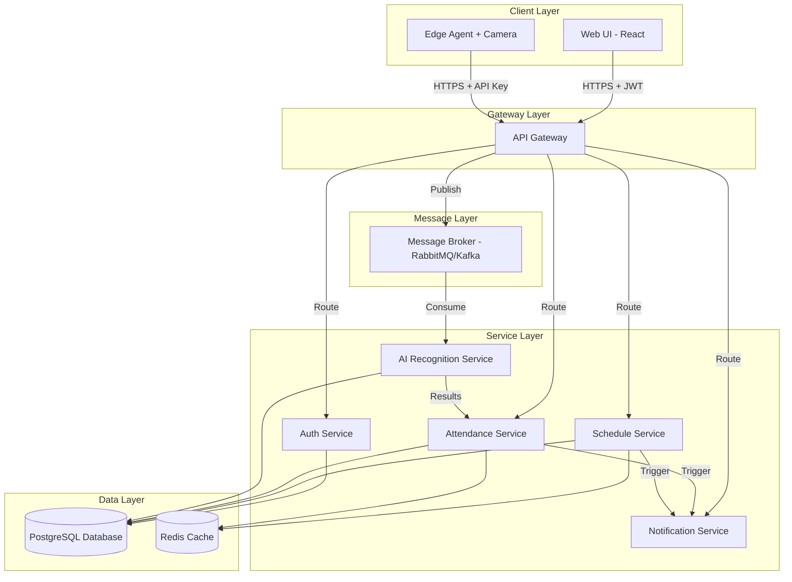
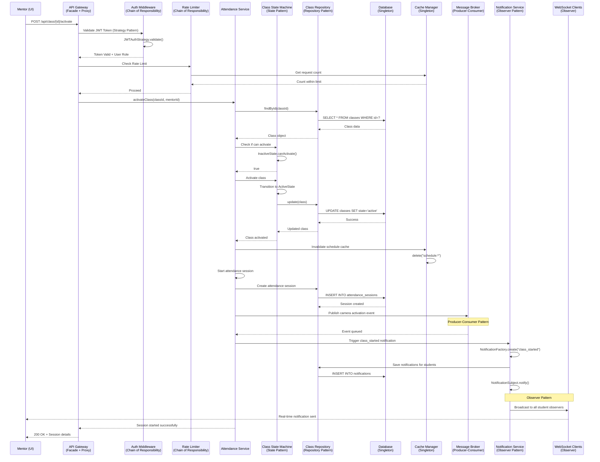
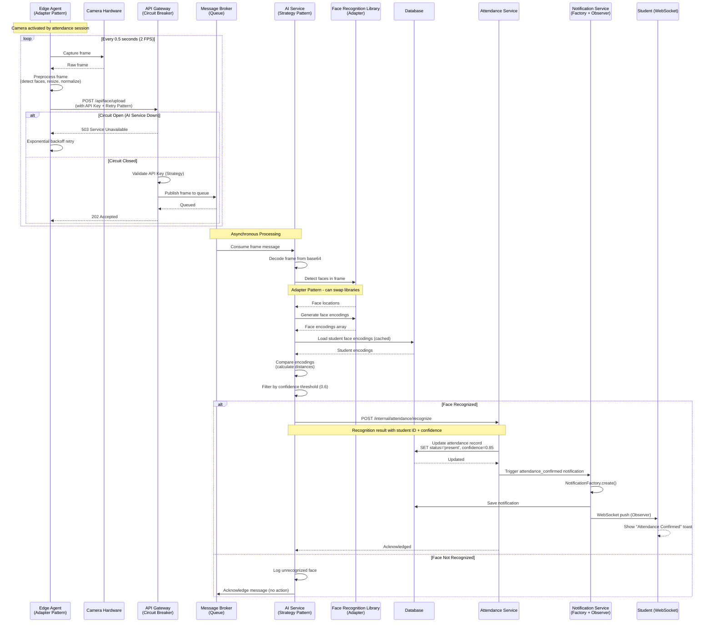
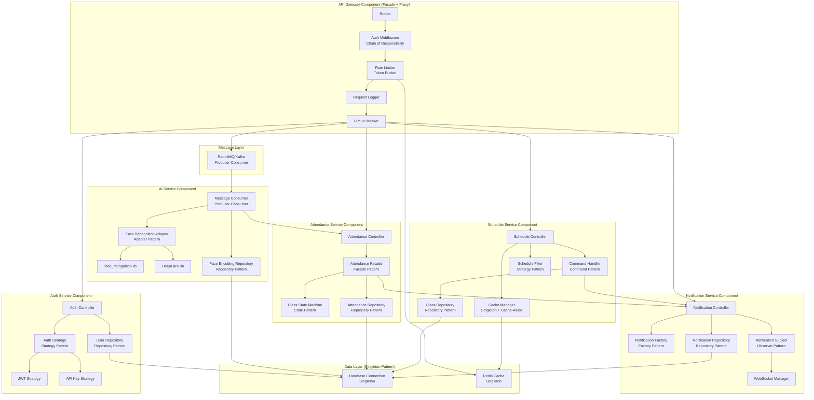
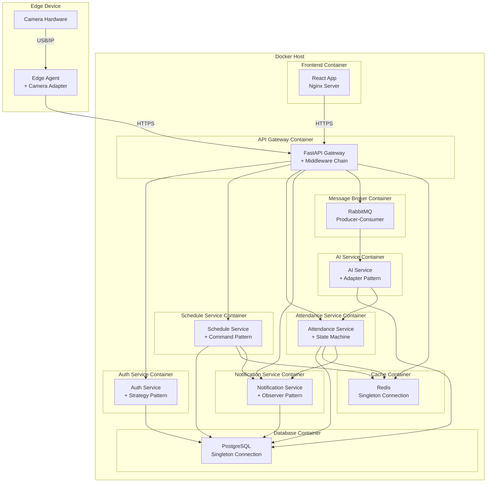
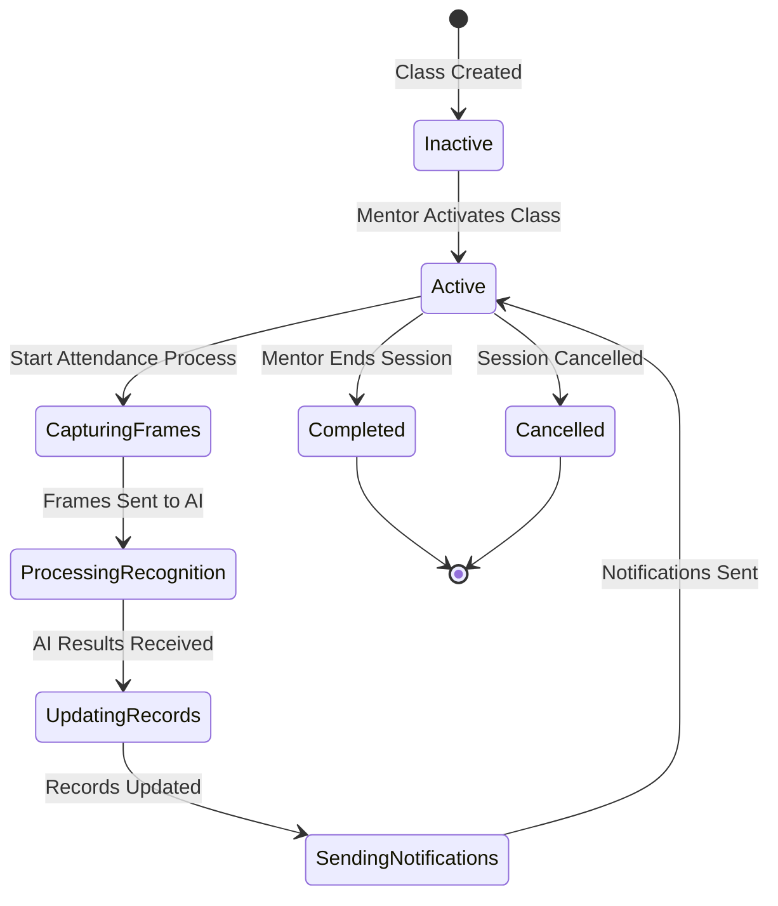

# Design Document

## Overview

The Face Recognition Attendance System is a distributed, event-driven application that automates student attendance tracking using AI-powered face recognition. The system follows a microservices architecture with clear separation of concerns, utilizing an API Gateway for unified access control, a Message Broker for asynchronous processing, and specialized services for authentication, scheduling, attendance management, and face recognition.

The architecture prioritizes scalability, reliability, and real-time responsiveness while maintaining security through JWT-based authentication and API key validation.

## Architecture

### High-Level Architecture



### Design Patterns Overview

The system implements multiple design patterns for maintainability, scalability, and flexibility:

**Architectural Patterns:**
- Microservices Architecture
- API Gateway Pattern
- Event-Driven Architecture (Message Broker)

**Creational Patterns:**
- Singleton (Database connections, Config)
- Factory (Notification creation, Service clients)

**Structural Patterns:**
- Repository (Data access abstraction)
- Adapter (Camera, AI libraries)
- Facade (Complex workflow simplification)
- Proxy (Caching, API Gateway)

**Behavioral Patterns:**
- Observer (WebSocket notifications)
- State (Class/Session state machines)
- Strategy (Authentication, Filtering)
- Chain of Responsibility (Middleware)
- Command (CRUD operations)
- Template Method (Base service structure)

**Concurrency Patterns:**
- Producer-Consumer (Frame processing)
- Circuit Breaker (Fault tolerance)

**Data Patterns:**
- Cache-Aside
- Database per Service
- CQRS (Light version)

### UML Class Diagram - Core Services with Design Patterns

```mermaid
classDiagram
    %% Repository Pattern
    class IRepository~T~ {
        <<interface>>
        +create(entity: T) T
        +findById(id: UUID) T
        +findAll() List~T~
        +update(id: UUID, entity: T) T
        +delete(id: UUID) bool
    }
    
    class UserRepository {
        -db_connection: DatabaseConnection
        +create(user: User) User
        +findById(id: UUID) User
        +findByEmail(email: str) User
        +findByRole(role: str) List~User~
    }
    
    class ClassRepository {
        -db_connection: DatabaseConnection
        +create(class: Class) Class
        +findById(id: UUID) Class
        +findByMentor(mentorId: UUID) List~Class~
        +findByStudent(studentId: UUID) List~Class~
    }
    
    class AttendanceRepository {
        -db_connection: DatabaseConnection
        +create(record: AttendanceRecord) AttendanceRecord
        +findBySession(sessionId: UUID) List~AttendanceRecord~
        +findByStudent(studentId: UUID) List~AttendanceRecord~
    }
    
    IRepository~T~ <|.. UserRepository
    IRepository~T~ <|.. ClassRepository
    IRepository~T~ <|.. AttendanceRepository
    
    %% Singleton Pattern
    class DatabaseConnection {
        <<singleton>>
        -instance: DatabaseConnection
        -connection_pool: Pool
        -DatabaseConnection()
        +getInstance() DatabaseConnection
        +getConnection() Connection
        +closeConnection(conn: Connection)
    }
    
    class CacheManager {
        <<singleton>>
        -instance: CacheManager
        -redis_client: Redis
        -CacheManager()
        +getInstance() CacheManager
        +get(key: str) Any
        +set(key: str, value: Any, ttl: int)
        +delete(key: str)
        +invalidate(pattern: str)
    }
    
    %% Strategy Pattern - Authentication
    class IAuthStrategy {
        <<interface>>
        +authenticate(credentials: Any) AuthResult
        +validate(token: Any) bool
    }
    
    class JWTAuthStrategy {
        -secret_key: str
        -algorithm: str
        +authenticate(credentials: LoginCredentials) AuthResult
        +validate(token: str) bool
        +generateToken(user: User) str
        +refreshToken(token: str) str
    }
    
    class APIKeyAuthStrategy {
        -api_key_repository: APIKeyRepository
        +authenticate(credentials: APIKey) AuthResult
        +validate(key: str) bool
    }
    
    IAuthStrategy <|.. JWTAuthStrategy
    IAuthStrategy <|.. APIKeyAuthStrategy
    
    %% Strategy Pattern - Schedule Filtering
    class IScheduleFilterStrategy {
        <<interface>>
        +filter(classes: List~Class~, userId: UUID) List~Class~
    }
    
    class StudentScheduleFilter {
        +filter(classes: List~Class~, studentId: UUID) List~Class~
    }
    
    class MentorScheduleFilter {
        +filter(classes: List~Class~, mentorId: UUID) List~Class~
    }
    
    class SupervisorScheduleFilter {
        +filter(classes: List~Class~, supervisorId: UUID) List~Class~
    }
    
    IScheduleFilterStrategy <|.. StudentScheduleFilter
    IScheduleFilterStrategy <|.. MentorScheduleFilter
    IScheduleFilterStrategy <|.. SupervisorScheduleFilter
    
    %% State Pattern - Class State
    class ClassState {
        <<abstract>>
        +activate(class: Class)*
        +deactivate(class: Class)*
        +canActivate() bool*
        +canDeactivate() bool*
    }
    
    class InactiveState {
        +activate(class: Class)
        +deactivate(class: Class)
        +canActivate() bool
        +canDeactivate() bool
    }
    
    class ActiveState {
        +activate(class: Class)
        +deactivate(class: Class)
        +canActivate() bool
        +canDeactivate() bool
    }
    
    class CompletedState {
        +activate(class: Class)
        +deactivate(class: Class)
        +canActivate() bool
        +canDeactivate() bool
    }
    
    ClassState <|-- InactiveState
    ClassState <|-- ActiveState
    ClassState <|-- CompletedState
    
    %% Factory Pattern - Notifications
    class NotificationFactory {
        <<factory>>
        +createNotification(type: str, data: dict) Notification
        -createClassStartedNotification(data: dict) Notification
        -createAttendanceConfirmedNotification(data: dict) Notification
        -createAbsentNotification(data: dict) Notification
        -createLateNotification(data: dict) Notification
    }
    
    class Notification {
        +id: UUID
        +userId: UUID
        +type: str
        +title: str
        +message: str
        +data: dict
        +createdAt: datetime
    }
    
    NotificationFactory ..> Notification : creates
    
    %% Observer Pattern - WebSocket
    class NotificationSubject {
        -observers: List~NotificationObserver~
        +attach(observer: NotificationObserver)
        +detach(observer: NotificationObserver)
        +notify(notification: Notification)
    }
    
    class NotificationObserver {
        <<interface>>
        +update(notification: Notification)*
    }
    
    class WebSocketClient {
        -connection: WebSocket
        -userId: UUID
        +update(notification: Notification)
        +send(message: str)
    }
    
    NotificationSubject o-- NotificationObserver
    NotificationObserver <|.. WebSocketClient
    
    %% Command Pattern
    class ICommand {
        <<interface>>
        +execute()*
        +undo()*
    }
    
    class CreateClassCommand {
        -repository: ClassRepository
        -classData: ClassCreate
        -createdClass: Class
        +execute()
        +undo()
    }
    
    class UpdateClassCommand {
        -repository: ClassRepository
        -classId: UUID
        -newData: ClassUpdate
        -oldData: Class
        +execute()
        +undo()
    }
    
    class DeleteClassCommand {
        -repository: ClassRepository
        -classId: UUID
        -deletedClass: Class
        +execute()
        +undo()
    }
    
    ICommand <|.. CreateClassCommand
    ICommand <|.. UpdateClassCommand
    ICommand <|.. DeleteClassCommand
    
    %% Services using patterns
    class AuthService {
        -authStrategy: IAuthStrategy
        -userRepository: UserRepository
        -dbConnection: DatabaseConnection
        +login(credentials: Any) AuthResult
        +validateToken(token: Any) bool
        +setAuthStrategy(strategy: IAuthStrategy)
    }
    
    class ScheduleService {
        -classRepository: ClassRepository
        -filterStrategy: IScheduleFilterStrategy
        -cacheManager: CacheManager
        -notificationSubject: NotificationSubject
        +getSchedule(userId: UUID, role: str) List~Class~
        +createClass(classData: ClassCreate) Class
        +updateClass(classId: UUID, data: ClassUpdate) Class
        +deleteClass(classId: UUID) bool
    }
    
    class AttendanceService {
        -attendanceRepository: AttendanceRepository
        -sessionRepository: SessionRepository
        -notificationSubject: NotificationSubject
        +startSession(classId: UUID) AttendanceSession
        +endSession(sessionId: UUID) AttendanceSession
        +markAttendance(sessionId: UUID, studentId: UUID, status: str)
        +processAIResults(results: List~RecognitionResult~)
    }
    
    AuthService --> IAuthStrategy
    AuthService --> UserRepository
    AuthService --> DatabaseConnection
    
    ScheduleService --> ClassRepository
    ScheduleService --> IScheduleFilterStrategy
    ScheduleService --> CacheManager
    ScheduleService --> NotificationSubject
    
    AttendanceService --> AttendanceRepository
    AttendanceService --> NotificationSubject
```



### UML Sequence Diagram - Class Activation with Design Patterns



### UML Sequence Diagram - Face Recognition Pipeline



### UML Component Diagram - Microservices with Patterns



### UML Deployment Diagram - Docker Architecture



### Technology Stack

**Frontend:**
- React with Vite
- React Router for navigation
- Axios for API calls
- WebSocket for real-time notifications
- TailwindCSS for styling

**Backend:**
- FastAPI (Python) for all microservices
- PostgreSQL for persistent data storage
- Redis for caching and session management
- RabbitMQ or Apache Kafka for message brokering
- WebSocket for real-time push notifications

**AI/ML:**
- Face recognition library (face_recognition or DeepFace)
- OpenCV for image preprocessing
- NumPy for numerical operations

**Infrastructure:**
- Docker for containerization
- Nginx as reverse proxy (API Gateway implementation)
- JWT for authentication tokens

## Components and Interfaces

### 1. API Gateway

**Responsibilities:**
- Single entry point for all client requests
- Authentication and authorization
- Request routing to appropriate services
- Rate limiting and throttling
- Protocol translation if needed

**Implementation:**
- Built using Nginx with custom Lua scripts or FastAPI with middleware
- JWT validation for UI clients
- API Key validation for Edge Agents
- Rate limiting using Redis-based token bucket algorithm

**Endpoints:**
```
POST   /api/auth/login
POST   /api/auth/refresh
GET    /api/schedule
POST   /api/schedule (supervisor only)
PUT    /api/schedule/{id} (supervisor only)
DELETE /api/schedule/{id} (supervisor only)
POST   /api/class/{id}/activate (mentor only)
POST   /api/class/{id}/deactivate (mentor only)
POST   /api/attendance/manual (mentor only)
GET    /api/attendance/history
POST   /api/face/upload (edge agent only)
GET    /api/notifications
WS     /ws/notifications
```

**Rate Limits:**
- UI Clients: 100 requests per minute
- Edge Agents: 500 requests per minute (higher for frame uploads)
- Authentication endpoints: 10 requests per minute

### 2. Authentication Service

**Responsibilities:**
- User authentication and authorization
- JWT token generation and validation
- Role-based access control (RBAC)
- Session management

**Database Schema:**
```sql
CREATE TABLE users (
    id UUID PRIMARY KEY DEFAULT gen_random_uuid(),
    email VARCHAR(255) UNIQUE NOT NULL,
    password_hash VARCHAR(255) NOT NULL,
    role VARCHAR(50) NOT NULL CHECK (role IN ('student', 'mentor', 'supervisor')),
    first_name VARCHAR(100) NOT NULL,
    last_name VARCHAR(100) NOT NULL,
    created_at TIMESTAMP DEFAULT CURRENT_TIMESTAMP,
    updated_at TIMESTAMP DEFAULT CURRENT_TIMESTAMP
);

CREATE TABLE api_keys (
    id UUID PRIMARY KEY DEFAULT gen_random_uuid(),
    key_hash VARCHAR(255) UNIQUE NOT NULL,
    edge_agent_id VARCHAR(100) NOT NULL,
    created_at TIMESTAMP DEFAULT CURRENT_TIMESTAMP,
    expires_at TIMESTAMP,
    is_active BOOLEAN DEFAULT TRUE
);
```

**JWT Payload Structure:**
```json
{
  "sub": "user_id",
  "email": "user@example.com",
  "role": "student|mentor|supervisor",
  "exp": 1234567890,
  "iat": 1234567890
}
```

### 3. Schedule Service

**Responsibilities:**
- Manage class schedules (CRUD operations)
- Synchronize schedules across roles
- Filter schedules based on user role
- Trigger notifications on schedule changes

**Database Schema:**
```sql
CREATE TABLE courses (
    id UUID PRIMARY KEY DEFAULT gen_random_uuid(),
    name VARCHAR(255) NOT NULL,
    code VARCHAR(50) UNIQUE NOT NULL,
    description TEXT,
    created_at TIMESTAMP DEFAULT CURRENT_TIMESTAMP
);

CREATE TABLE classes (
    id UUID PRIMARY KEY DEFAULT gen_random_uuid(),
    course_id UUID REFERENCES courses(id) ON DELETE CASCADE,
    mentor_id UUID REFERENCES users(id) ON DELETE SET NULL,
    room VARCHAR(100) NOT NULL,
    scheduled_date DATE NOT NULL,
    start_time TIME NOT NULL,
    end_time TIME NOT NULL,
    content TEXT,
    state VARCHAR(20) DEFAULT 'inactive' CHECK (state IN ('active', 'inactive')),
    created_at TIMESTAMP DEFAULT CURRENT_TIMESTAMP,
    updated_at TIMESTAMP DEFAULT CURRENT_TIMESTAMP
);

CREATE TABLE class_enrollments (
    id UUID PRIMARY KEY DEFAULT gen_random_uuid(),
    class_id UUID REFERENCES classes(id) ON DELETE CASCADE,
    student_id UUID REFERENCES users(id) ON DELETE CASCADE,
    enrolled_at TIMESTAMP DEFAULT CURRENT_TIMESTAMP,
    UNIQUE(class_id, student_id)
);

CREATE INDEX idx_classes_mentor ON classes(mentor_id);
CREATE INDEX idx_classes_date ON classes(scheduled_date);
CREATE INDEX idx_enrollments_student ON class_enrollments(student_id);
CREATE INDEX idx_enrollments_class ON class_enrollments(class_id);
```

**API Interface:**
```python
class ScheduleService:
    async def create_class(self, class_data: ClassCreate) -> Class
    async def update_class(self, class_id: UUID, class_data: ClassUpdate) -> Class
    async def delete_class(self, class_id: UUID) -> bool
    async def get_schedule_for_student(self, student_id: UUID) -> List[Class]
    async def get_schedule_for_mentor(self, mentor_id: UUID) -> List[Class]
    async def get_full_schedule(self) -> List[Class]
    async def get_class_details(self, class_id: UUID) -> ClassDetails
```

**Caching Strategy:**
- Cache user-specific schedules in Redis with 5-minute TTL
- Invalidate cache on schedule modifications
- Use cache-aside pattern for read operations

### 4. Attendance Service

**Responsibilities:**
- Manage attendance process lifecycle
- Activate/deactivate camera and edge agent
- Process AI recognition results
- Handle manual attendance marking
- Store and retrieve attendance records
- Calculate attendance statistics

**Database Schema:**
```sql
CREATE TABLE attendance_sessions (
    id UUID PRIMARY KEY DEFAULT gen_random_uuid(),
    class_id UUID REFERENCES classes(id) ON DELETE CASCADE,
    started_at TIMESTAMP NOT NULL,
    ended_at TIMESTAMP,
    attendance_window_minutes INTEGER DEFAULT 15,
    state VARCHAR(20) DEFAULT 'active' CHECK (state IN ('active', 'completed', 'cancelled')),
    created_at TIMESTAMP DEFAULT CURRENT_TIMESTAMP
);

CREATE TABLE attendance_records (
    id UUID PRIMARY KEY DEFAULT gen_random_uuid(),
    session_id UUID REFERENCES attendance_sessions(id) ON DELETE CASCADE,
    student_id UUID REFERENCES users(id) ON DELETE CASCADE,
    status VARCHAR(20) NOT NULL CHECK (status IN ('present', 'absent', 'late')),
    marked_at TIMESTAMP,
    recognition_confidence FLOAT,
    marked_manually BOOLEAN DEFAULT FALSE,
    marked_by UUID REFERENCES users(id),
    created_at TIMESTAMP DEFAULT CURRENT_TIMESTAMP,
    UNIQUE(session_id, student_id)
);

CREATE INDEX idx_attendance_session ON attendance_records(session_id);
CREATE INDEX idx_attendance_student ON attendance_records(student_id);
CREATE INDEX idx_sessions_class ON attendance_sessions(class_id);
```

**State Machine for Attendance Process:**


**API Interface:**
```python
class AttendanceService:
    async def start_attendance_session(self, class_id: UUID) -> AttendanceSession
    async def end_attendance_session(self, session_id: UUID) -> AttendanceSession
    async def mark_attendance_manually(self, session_id: UUID, student_id: UUID, status: str) -> AttendanceRecord
    async def process_ai_results(self, session_id: UUID, results: List[RecognitionResult]) -> List[AttendanceRecord]
    async def get_attendance_history(self, user_id: UUID, role: str, filters: AttendanceFilters) -> List[AttendanceRecord]
    async def get_session_status(self, session_id: UUID) -> SessionStatus
    async def calculate_statistics(self, student_id: UUID) -> AttendanceStats
```

### 5. Edge Agent

**Responsibilities:**
- Control camera hardware
- Capture frames at configured intervals
- Preprocess frames (resize, normalize, face detection)
- Send preprocessed frames to Message Broker via API Gateway
- Handle camera errors and reconnection

**Implementation:**
- Python application running on edge device
- OpenCV for camera control and preprocessing
- Requests library for API communication
- Configurable frame capture rate (default: 2 frames per second)

**Frame Preprocessing Pipeline:**
1. Capture raw frame from camera
2. Detect faces using Haar Cascade or MTCNN
3. Extract face regions with padding
4. Resize to standard dimensions (224x224)
5. Normalize pixel values
6. Encode as JPEG with compression
7. Send to API Gateway with metadata

**Configuration:**
```json
{
  "camera_id": 0,
  "api_gateway_url": "https://api.example.com",
  "api_key": "edge_agent_key",
  "capture_fps": 2,
  "face_detection_model": "haarcascade",
  "frame_width": 224,
  "frame_height": 224,
  "jpeg_quality": 85,
  "retry_attempts": 3,
  "retry_delay_seconds": 5
}
```

### 6. Message Broker

**Responsibilities:**
- Queue face recognition requests
- Decouple Edge Agent from AI Service
- Provide reliability through message persistence
- Enable load balancing across multiple AI Service instances

**Implementation:**
- RabbitMQ or Apache Kafka
- Durable queues for message persistence
- Dead letter queue for failed messages
- Message TTL: 5 minutes

**Queue Structure:**
```
Exchange: face_recognition_exchange (topic)
Queue: face_recognition_queue
Routing Key: face.recognition.request
Message Format:
{
  "session_id": "uuid",
  "class_id": "uuid",
  "frame_data": "base64_encoded_image",
  "timestamp": "iso8601",
  "edge_agent_id": "string",
  "metadata": {
    "frame_number": 123,
    "capture_time": "iso8601"
  }
}
```

### 7. AI Recognition Service

**Responsibilities:**
- Consume face recognition requests from Message Broker
- Perform face recognition on frames
- Match faces against student database
- Send recognition results to Attendance Service
- Handle recognition failures gracefully

**Implementation:**
- Python service using face_recognition or DeepFace library
- Load student face encodings from database on startup
- Batch processing for efficiency
- Confidence threshold: 0.6 (configurable)

**Face Recognition Pipeline:**
1. Decode frame from base64
2. Detect faces in frame
3. Generate face encodings
4. Compare encodings with known student encodings
5. Calculate confidence scores
6. Filter results by confidence threshold
7. Send results to Attendance Service

**Database Schema:**
```sql
CREATE TABLE face_encodings (
    id UUID PRIMARY KEY DEFAULT gen_random_uuid(),
    student_id UUID REFERENCES users(id) ON DELETE CASCADE,
    encoding BYTEA NOT NULL,
    image_url VARCHAR(500),
    created_at TIMESTAMP DEFAULT CURRENT_TIMESTAMP,
    updated_at TIMESTAMP DEFAULT CURRENT_TIMESTAMP
);

CREATE INDEX idx_face_encodings_student ON face_encodings(student_id);
```

**API Interface:**
```python
class AIRecognitionService:
    async def process_frame(self, frame_data: bytes, session_id: UUID) -> List[RecognitionResult]
    async def load_student_encodings(self) -> Dict[UUID, List[np.ndarray]]
    async def add_student_encoding(self, student_id: UUID, image: bytes) -> FaceEncoding
    async def update_student_encoding(self, student_id: UUID, image: bytes) -> FaceEncoding
```

**Recognition Result Format:**
```json
{
  "session_id": "uuid",
  "timestamp": "iso8601",
  "results": [
    {
      "student_id": "uuid",
      "confidence": 0.85,
      "face_location": [top, right, bottom, left]
    }
  ]
}
```

### 8. Notification Service

**Responsibilities:**
- Send real-time notifications to users
- Support multiple notification channels (WebSocket, email)
- Queue notifications for offline users
- Track notification delivery status

**Database Schema:**
```sql
CREATE TABLE notifications (
    id UUID PRIMARY KEY DEFAULT gen_random_uuid(),
    user_id UUID REFERENCES users(id) ON DELETE CASCADE,
    type VARCHAR(50) NOT NULL,
    title VARCHAR(255) NOT NULL,
    message TEXT NOT NULL,
    data JSONB,
    is_read BOOLEAN DEFAULT FALSE,
    sent_at TIMESTAMP,
    created_at TIMESTAMP DEFAULT CURRENT_TIMESTAMP
);

CREATE INDEX idx_notifications_user ON notifications(user_id);
CREATE INDEX idx_notifications_unread ON notifications(user_id, is_read);
```

**Notification Types:**
- `class_started`: Class has been activated
- `attendance_confirmed`: Student attendance marked as present
- `attendance_absent`: Student marked as absent
- `attendance_late`: Student marked as late
- `class_cancelled`: Class has been cancelled
- `class_rescheduled`: Class time/location changed
- `schedule_updated`: Schedule modifications

**WebSocket Protocol:**
```json
{
  "type": "notification",
  "payload": {
    "id": "uuid",
    "type": "class_started",
    "title": "Class Started",
    "message": "Your Data Structures class has started in Room 101",
    "data": {
      "class_id": "uuid",
      "course_name": "Data Structures"
    },
    "timestamp": "iso8601"
  }
}
```

## Data Models

### Core Models

**User Model:**
```python
class User(BaseModel):
    id: UUID
    email: EmailStr
    role: Literal["student", "mentor", "supervisor"]
    first_name: str
    last_name: str
    created_at: datetime
    updated_at: datetime
```

**Class Model:**
```python
class Class(BaseModel):
    id: UUID
    course_id: UUID
    course_name: str
    mentor_id: UUID
    mentor_name: str
    room: str
    scheduled_date: date
    start_time: time
    end_time: time
    content: Optional[str]
    state: Literal["active", "inactive"]
    enrolled_students: List[UUID]
    created_at: datetime
    updated_at: datetime
```

**Attendance Record Model:**
```python
class AttendanceRecord(BaseModel):
    id: UUID
    session_id: UUID
    student_id: UUID
    student_name: str
    status: Literal["present", "absent", "late"]
    marked_at: Optional[datetime]
    recognition_confidence: Optional[float]
    marked_manually: bool
    marked_by: Optional[UUID]
    created_at: datetime
```

**Notification Model:**
```python
class Notification(BaseModel):
    id: UUID
    user_id: UUID
    type: str
    title: str
    message: str
    data: Optional[Dict]
    is_read: bool
    sent_at: Optional[datetime]
    created_at: datetime
```

## Error Handling

### Error Categories

**1. Authentication Errors (401, 403)**
- Invalid credentials
- Expired JWT token
- Insufficient permissions
- Invalid API key

**2. Validation Errors (400)**
- Invalid request payload
- Missing required fields
- Invalid data types
- Business rule violations

**3. Not Found Errors (404)**
- Resource does not exist
- User not found
- Class not found

**4. Conflict Errors (409)**
- Duplicate enrollment
- Class already active
- Schedule conflict

**5. Rate Limit Errors (429)**
- Too many requests
- Quota exceeded

**6. Server Errors (500, 503)**
- Database connection failure
- AI service unavailable
- Message broker unavailable
- Unexpected exceptions

### Error Response Format

```json
{
  "error": {
    "code": "RESOURCE_NOT_FOUND",
    "message": "Class with ID abc123 not found",
    "details": {
      "resource_type": "class",
      "resource_id": "abc123"
    },
    "timestamp": "2025-11-30T10:30:00Z",
    "request_id": "req_xyz789"
  }
}
```

### Retry Strategy

**Edge Agent to API Gateway:**
- Exponential backoff: 1s, 2s, 4s
- Max retries: 3
- Timeout: 30 seconds per request

**AI Service Processing:**
- Retry failed recognitions: 2 attempts
- Move to dead letter queue after failures
- Alert on repeated failures

**Database Operations:**
- Retry on connection errors: 3 attempts
- Use connection pooling
- Circuit breaker pattern for cascading failures

## Testing Strategy

### Unit Testing

**Coverage Target: 80%**

**Components to Test:**
- Authentication logic (JWT generation, validation)
- Schedule filtering by role
- Attendance status calculation
- Face recognition matching algorithm
- Notification formatting

**Tools:**
- pytest for Python services
- Jest for React frontend
- Mock external dependencies (database, message broker)

### Integration Testing

**Scenarios:**
- End-to-end class activation flow
- Schedule synchronization across roles
- Face recognition pipeline from frame capture to attendance marking
- Notification delivery through WebSocket
- API Gateway routing and authentication

**Tools:**
- pytest with test database
- Docker Compose for service orchestration
- Testcontainers for database and message broker

### Performance Testing

**Metrics:**
- API response time: < 200ms (p95)
- Face recognition latency: < 2 seconds per frame
- WebSocket message delivery: < 100ms
- Database query time: < 50ms (p95)
- Concurrent users: Support 1000 simultaneous connections

**Tools:**
- Locust for load testing
- Apache JMeter for API testing
- Custom scripts for face recognition benchmarking

### Security Testing

**Areas:**
- JWT token validation and expiration
- SQL injection prevention
- XSS protection in frontend
- API rate limiting effectiveness
- HTTPS enforcement
- API key rotation

**Tools:**
- OWASP ZAP for vulnerability scanning
- Bandit for Python security linting
- npm audit for frontend dependencies

### User Acceptance Testing

**Test Cases:**
- Student receives notification when class starts
- Mentor can manually mark attendance
- Supervisor can modify schedule and changes propagate
- Face recognition correctly identifies students
- Attendance history displays accurately

**Approach:**
- Manual testing with real users
- Feedback collection through surveys
- Usability testing sessions
