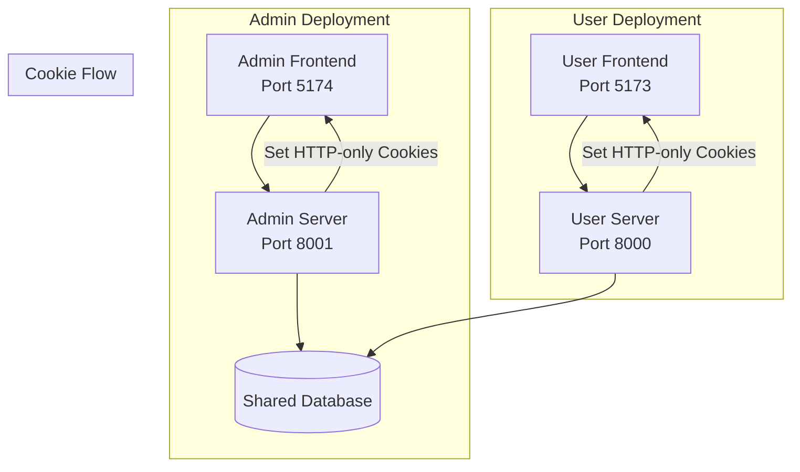

# Design Document: Multi-Server Deployment with Cookie Authentication

## Overview

This design describes the architecture for splitting the Face Recognition Attendance System into two separate server deployments (Admin and Student/Mentor) while migrating from localStorage to HTTP-only cookies for token storage.

The solution uses:
- Environment-based server mode configuration
- Role-gated login middleware
- Conditional route registration
- HTTP-only cookies for secure token storage
- Server-aware frontend with theme adaptation

## Architecture



## Components and Interfaces

### 1. Server Configuration Module

**File:** `FastAPI/shared/config/server_config.py`

```python
from enum import Enum
from pydantic_settings import BaseSettings

class ServerMode(str, Enum):
    ADMIN = "ADMIN"
    USER = "USER"

class ServerConfig(BaseSettings):
    server_mode: ServerMode = ServerMode.USER
    server_port: int = 8000
    cookie_secure: bool = False  # True in production
    cookie_samesite: str = "lax"
    cookie_domain: str | None = None
    
    class Config:
        env_prefix = ""

def get_server_config() -> ServerConfig:
    return ServerConfig()
```

### 2. Cookie Service

**File:** `FastAPI/services/auth_service/services/cookie_service.py`

```python
from fastapi import Response
from datetime import datetime, timedelta

class CookieService:
    def __init__(self, config: ServerConfig):
        self.config = config
    
    def set_auth_cookies(self, response: Response, access_token: str, refresh_token: str):
        """Set HTTP-only cookies for authentication tokens"""
        response.set_cookie(
            key="access_token",
            value=access_token,
            httponly=True,
            secure=self.config.cookie_secure,
            samesite=self.config.cookie_samesite,
            max_age=30 * 60,  # 30 minutes
            path="/"
        )
        response.set_cookie(
            key="refresh_token",
            value=refresh_token,
            httponly=True,
            secure=self.config.cookie_secure,
            samesite=self.config.cookie_samesite,
            max_age=7 * 24 * 60 * 60,  # 7 days
            path="/api/auth/refresh"
        )
    
    def set_user_cookie(self, response: Response, user_data: dict):
        """Set non-HTTP-only cookie for user data (frontend readable)"""
        import json
        response.set_cookie(
            key="user",
            value=json.dumps(user_data),
            httponly=False,
            secure=self.config.cookie_secure,
            samesite=self.config.cookie_samesite,
            max_age=30 * 60,
            path="/"
        )
    
    def set_remember_me_cookies(self, response: Response, email: str, encrypted_password: str):
        """Set remember me cookies (30 days)"""
        response.set_cookie(
            key="remember_email",
            value=email,
            httponly=False,
            secure=self.config.cookie_secure,
            samesite=self.config.cookie_samesite,
            max_age=30 * 24 * 60 * 60,  # 30 days
            path="/"
        )
        response.set_cookie(
            key="remember_password",
            value=encrypted_password,
            httponly=False,
            secure=self.config.cookie_secure,
            samesite=self.config.cookie_samesite,
            max_age=30 * 24 * 60 * 60,
            path="/"
        )
    
    def clear_auth_cookies(self, response: Response):
        """Clear all authentication cookies"""
        response.delete_cookie("access_token", path="/")
        response.delete_cookie("refresh_token", path="/api/auth/refresh")
        response.delete_cookie("user", path="/")
    
    def clear_remember_me_cookies(self, response: Response):
        """Clear remember me cookies"""
        response.delete_cookie("remember_email", path="/")
        response.delete_cookie("remember_password", path="/")
```

### 3. Role Gate Middleware

**File:** `FastAPI/shared/middleware/role_gate.py`

```python
from fastapi import Request, HTTPException, status
from shared.config.server_config import ServerMode, get_server_config

ADMIN_ALLOWED_ROLES = ["admin"]
USER_ALLOWED_ROLES = ["student", "mentor"]

def validate_role_for_server(user_role: str) -> bool:
    """Check if user role is allowed on current server"""
    config = get_server_config()
    
    if config.server_mode == ServerMode.ADMIN:
        return user_role in ADMIN_ALLOWED_ROLES
    else:
        return user_role in USER_ALLOWED_ROLES

def get_role_gate_error_message() -> str:
    config = get_server_config()
    if config.server_mode == ServerMode.ADMIN:
        return "Access denied: This server is for administrators only"
    return "Access denied: This server is for students and mentors only"
```

### 4. Updated Auth Dependencies

**File:** `FastAPI/services/auth_service/api/dependencies.py` (modified)

```python
from fastapi import Request, HTTPException, status, Cookie
from typing import Optional

def get_token_from_cookie(request: Request) -> str:
    """Extract access token from HTTP-only cookie"""
    token = request.cookies.get("access_token")
    if not token:
        raise HTTPException(
            status_code=status.HTTP_401_UNAUTHORIZED,
            detail="Not authenticated"
        )
    return token

async def get_current_user(
    request: Request,
    db: Session = Depends(get_db_session)
) -> User:
    """Get current user from cookie token"""
    token = get_token_from_cookie(request)
    # ... existing token validation logic
```

### 5. Server Info Endpoint

**File:** `FastAPI/main.py` (addition)

```python
@app.get("/api/server-info", tags=["Server"])
def get_server_info():
    """Return server mode and configuration"""
    config = get_server_config()
    return {
        "server_mode": config.server_mode.value,
        "server_name": "Admin Portal" if config.server_mode == ServerMode.ADMIN else "Attendance System",
        "features": {
            "remember_me": config.server_mode == ServerMode.USER
        }
    }
```

### 6. Conditional Route Registration

**File:** `FastAPI/main.py` (modified)

```python
from shared.config.server_config import get_server_config, ServerMode

config = get_server_config()

# Always include auth routes
app.include_router(auth_router, prefix="/api/auth", tags=["Auth Service"])

if config.server_mode == ServerMode.ADMIN:
    # Admin-only routes
    app.include_router(stats_router, prefix="/api/stats", tags=["Stats Service"])
    # User management is in auth_router but gated by role
else:
    # User-only routes
    app.include_router(schedule_router, prefix="/api/schedule", tags=["Schedule Service"])
    app.include_router(attendance_router, prefix="/api/attendance", tags=["Attendance Service"])
    app.include_router(ai_router, prefix="/api/ai", tags=["AI Service"])
    app.include_router(notification_router, prefix="/api/notifications", tags=["Notification Service"])
    app.include_router(notification_ws_router, prefix="/api/notifications", tags=["Notification WebSocket"])
```

## Data Models

### Cookie Configuration Schema

```python
class CookieConfig:
    access_token_max_age: int = 1800  # 30 minutes
    refresh_token_max_age: int = 604800  # 7 days
    remember_me_max_age: int = 2592000  # 30 days
    httponly_tokens: bool = True
    secure: bool = False  # Set via env
    samesite: str = "lax"
```

### Server Info Response

```python
class ServerInfoResponse(BaseModel):
    server_mode: str  # "ADMIN" or "USER"
    server_name: str
    features: dict  # {"remember_me": bool}
```

### Login Request (Updated)

```python
class LoginRequest(BaseModel):
    email: str
    password: str
    remember_me: bool = False  # Only used on USER server
```

## Frontend Changes

### 1. Server Context

**File:** `frontend/my-app/src/context/ServerContext.tsx`

```typescript
interface ServerInfo {
  server_mode: 'ADMIN' | 'USER';
  server_name: string;
  features: {
    remember_me: boolean;
  };
}

const ServerContext = createContext<ServerInfo | null>(null);

export function ServerProvider({ children }) {
  const [serverInfo, setServerInfo] = useState<ServerInfo | null>(null);
  
  useEffect(() => {
    fetch('/api/server-info', { credentials: 'include' })
      .then(res => res.json())
      .then(setServerInfo);
  }, []);
  
  return (
    <ServerContext.Provider value={serverInfo}>
      {children}
    </ServerContext.Provider>
  );
}
```

### 2. Cookie Utilities

**File:** `frontend/my-app/src/utils/cookies.ts`

```typescript
export function getCookie(name: string): string | null {
  const match = document.cookie.match(new RegExp('(^| )' + name + '=([^;]+)'));
  return match ? decodeURIComponent(match[2]) : null;
}

export function setCookie(name: string, value: string, days: number) {
  const expires = new Date(Date.now() + days * 864e5).toUTCString();
  document.cookie = `${name}=${encodeURIComponent(value)}; expires=${expires}; path=/`;
}

export function deleteCookie(name: string) {
  document.cookie = `${name}=; expires=Thu, 01 Jan 1970 00:00:00 GMT; path=/`;
}

export function getUser(): User | null {
  const userCookie = getCookie('user');
  return userCookie ? JSON.parse(userCookie) : null;
}
```

### 3. API Client Update

**File:** `frontend/my-app/src/services/api.ts` (modified)

```typescript
export const api = axios.create({
  baseURL: API_BASE_URL,
  headers: {
    'Content-Type': 'application/json',
  },
  withCredentials: true,  // Always send cookies
});

// Remove Authorization header interceptor - cookies handle auth now
```

### 4. Admin Theme Variables

```css
/* Admin theme (red/orange accents) */
[data-server-mode="ADMIN"] {
  --primary: oklch(0.637 0.237 25.331);  /* Red-orange */
  --primary-foreground: oklch(0.98 0 0);
  --accent: oklch(0.705 0.213 47.604);   /* Orange */
}
```


## Correctness Properties

*A property is a characteristic or behavior that should hold true across all valid executions of a system—essentially, a formal statement about what the system should do. Properties serve as the bridge between human-readable specifications and machine-verifiable correctness guarantees.*

### Property 1: Role-Server Access Control

*For any* user attempting to login, the login SHALL succeed if and only if the user's role is in the allowed roles for the current server mode (admin role for ADMIN server, student/mentor roles for USER server).

**Validates: Requirements 2.1, 2.2, 2.4**

### Property 2: Auth Cookie Attributes

*For any* successful login response, the response SHALL set:
- `access_token` cookie with httpOnly=true, path="/"
- `refresh_token` cookie with httpOnly=true, path="/api/auth/refresh"
- `user` cookie with httpOnly=false (frontend readable)

**Validates: Requirements 7.1, 7.2, 7.3, 10.3**

### Property 3: Cookie Token Extraction

*For any* authenticated API request, the backend SHALL extract the access token from the `access_token` cookie (not from Authorization header), and requests without this cookie SHALL return 401.

**Validates: Requirements 7.7**

### Property 4: Logout Cookie Clearing

*For any* logout request, the response SHALL clear all auth cookies (access_token, refresh_token, user) by setting them to expire immediately.

**Validates: Requirements 7.6**

### Property 5: Remember Me Cookie Behavior

*For any* login request with `remember_me=true` on USER server, the response SHALL set:
- `remember_email` cookie with httpOnly=false, max-age=30 days
- `remember_password` cookie (encrypted) with httpOnly=false, max-age=30 days

*For any* login request with `remember_me=false`, existing remember cookies SHALL be cleared.

**Validates: Requirements 9.2, 9.3, 9.4, 9.7**

### Property 6: Server Info Response Format

*For any* request to `/api/server-info`, the response SHALL contain:
- `server_mode`: either "ADMIN" or "USER"
- `server_name`: string
- `features.remember_me`: boolean (true only when server_mode is "USER")

**Validates: Requirements 5.2**

### Property 7: Server Mode Configuration Default

*For any* server startup without SERVER_MODE environment variable, the server SHALL operate in "USER" mode.

**Validates: Requirements 1.2**

## Error Handling

### Authentication Errors

| Error Condition | HTTP Status | Error Message |
|----------------|-------------|---------------|
| Missing access_token cookie | 401 | "Not authenticated" |
| Invalid/expired access_token | 401 | "Token expired or invalid" |
| Wrong role for server | 403 | "Access denied for this server" |
| Invalid credentials | 401 | "Invalid email or password" |

### Cookie Errors

| Error Condition | Handling |
|----------------|----------|
| Malformed user cookie | Clear cookie, redirect to login |
| Expired refresh token | Clear all cookies, redirect to login |
| Cookie domain mismatch | Log warning, authentication fails |

### Server Configuration Errors

| Error Condition | Handling |
|----------------|----------|
| Invalid SERVER_MODE value | Log error, default to USER mode |
| Missing DATABASE_URL | Fail startup with clear error |

## Testing Strategy

### Unit Tests

Unit tests verify specific examples and edge cases:

1. **Configuration Tests**
   - Test SERVER_MODE parsing with valid values
   - Test default values when env vars missing
   - Test cookie configuration parsing

2. **Role Gate Tests**
   - Test admin role allowed on ADMIN server
   - Test admin role rejected on USER server
   - Test student/mentor roles allowed on USER server
   - Test student/mentor roles rejected on ADMIN server

3. **Cookie Service Tests**
   - Test cookie attribute setting
   - Test cookie clearing
   - Test remember me encryption/decryption

### Property-Based Tests

Property-based tests verify universal properties across many generated inputs using **pytest** with **hypothesis**.

Configuration:
- Minimum 100 iterations per property test
- Each test tagged with: **Feature: multi-server-deployment, Property {N}: {description}**

**Property Tests to Implement:**

1. **Property 1 Test**: Generate random users with random roles, verify login success/failure matches server mode
2. **Property 2 Test**: Generate successful login scenarios, verify all cookie attributes are correct
3. **Property 3 Test**: Generate authenticated requests, verify token extracted from cookie
4. **Property 4 Test**: Generate logout scenarios, verify all cookies cleared
5. **Property 5 Test**: Generate login requests with remember_me flag variations, verify cookie behavior
6. **Property 6 Test**: Generate server-info requests across server modes, verify response format
7. **Property 7 Test**: Generate server startups without SERVER_MODE, verify USER mode default

### Integration Tests

1. **Cross-Server Data Consistency**
   - Create user on admin server, verify accessible on user server
   - Mark attendance on user server, verify stats visible on admin server

2. **Frontend Cookie Flow**
   - Login flow sets cookies correctly
   - API requests include cookies automatically
   - Logout clears cookies and redirects

3. **Remember Me Flow**
   - Login with remember_me populates cookies
   - Page reload pre-fills credentials
   - Login without remember_me clears cookies
