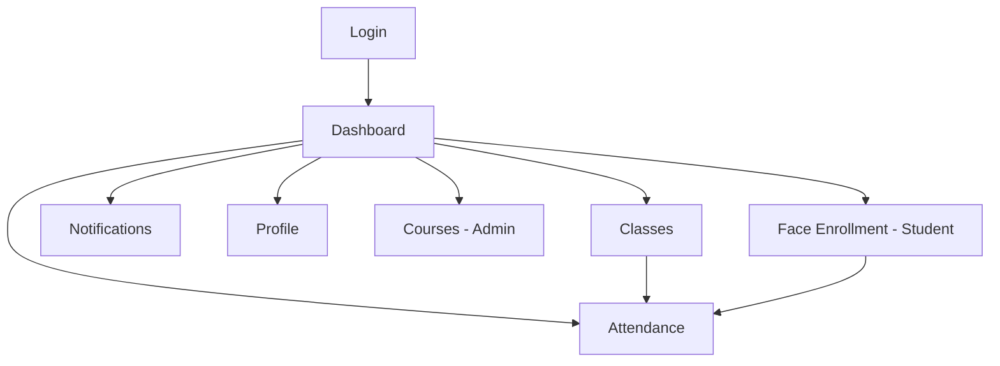

# v0 UI Prompts for Face Recognition Attendance System

This directory contains detailed prompts for generating each page/component using v0.dev. Each prompt includes:

- Complete design specifications
- Component structure and code examples
- API integration patterns
- State management
- Responsive design requirements
- Accessibility guidelines

## Prompt Files

### Pages
1. **[01-login-page.md](./01-login-page.md)** - Authentication login page
2. **[02-register-page.md](./02-register-page.md)** - User registration page
3. **[03-dashboard-page.md](./03-dashboard-page.md)** - Role-based dashboard with stats
4. **[04-courses-page.md](./04-courses-page.md)** - Course management (Admin only)
5. **[05-classes-page.md](./05-classes-page.md)** - Class management with session control
6. **[06-attendance-page.md](./06-attendance-page.md)** - Attendance session management
7. **[07-face-enrollment-page.md](./07-face-enrollment-page.md)** - Face registration with camera
8. **[08-notifications-page.md](./08-notifications-page.md)** - Notification center with real-time updates
9. **[09-profile-page.md](./09-profile-page.md)** - User profile and settings

### Components
10. **[10-sidebar-component.md](./10-sidebar-component.md)** - Navigation sidebar with role-based items

## How to Use

1. **Copy the entire prompt** from any `.md` file
2. **Paste into v0.dev** chat interface
3. **Review the generated code** and make adjustments
4. **Save the component** to the appropriate location in `src/pages/` or `src/components/`
5. **Import and integrate** with existing hooks and services

## Design System

All prompts follow a consistent design system:

- **Framework**: React 18 + TypeScript
- **Styling**: Tailwind CSS + shadcn/ui components
- **Icons**: Lucide React
- **Colors**: shadcn/ui CSS variables
- **Typography**: Inter/Geist Sans
- **Spacing**: Tailwind spacing scale

## Integration Notes

### Hooks Available
- `useAuth()` - Authentication state
- `useNotifications()` - Notification management
- `useAttendance()` - Attendance session management
- `useFaceEnrollment()` - Face registration
- `useWebSocket()` - Real-time connections

### Services Available
- `authApi` - Authentication API calls
- `courseApi` - Course management
- `classApi` - Class management
- `attendanceApi` - Attendance operations
- `aiApi` - Face enrollment/recognition
- `notificationApi` - Notification operations


### Components Available
- `Layout` - Main layout with sidebar
- `ProtectedRoute` - Route protection
- All shadcn/ui components

## Page Dependencies



## Implementation Order

### Phase 1: Authentication
1. Login page
2. Register page
3. Sidebar component

### Phase 2: Core Pages
4. Dashboard page
5. Profile page
6. Notifications page

### Phase 3: Management
7. Classes page
8. Attendance page
9. Courses page (Admin)
10. Face Enrollment page

## Testing Each Page

After implementing each page:

1. **Check routing** - Ensure page loads at correct URL
2. **Test authentication** - Verify role-based access
3. **Test API calls** - Ensure hooks/services work
4. **Test responsive** - Check mobile/tablet layouts
5. **Test states** - Loading, error, empty states
6. **Test interactions** - Forms, buttons, modals

## Common Patterns

### Loading States
```tsx
{isLoading ? (
  <div className="space-y-4">
    {[...Array(3)].map((_, i) => (
      <Skeleton key={i} className="h-20 w-full" />
    ))}
  </div>
) : (
  // Content
)}
```

### Error States
```tsx
{error && (
  <Alert variant="destructive">
    <AlertCircle className="h-4 w-4" />
    <AlertTitle>Error</AlertTitle>
    <AlertDescription>{error}</AlertDescription>
  </Alert>
)}
```

### Empty States
```tsx
<div className="flex flex-col items-center justify-center py-12">
  <Icon className="h-12 w-12 text-muted-foreground mb-4" />
  <h3 className="text-lg font-medium">No items found</h3>
  <p className="text-muted-foreground mb-4">Description</p>
  <Button>Action</Button>
</div>
```

## Support

If you encounter issues:
1. Check the backend API is running
2. Verify authentication tokens
3. Check browser console for errors
4. Ensure all dependencies are installed
5. Verify TypeScript types match API responses
